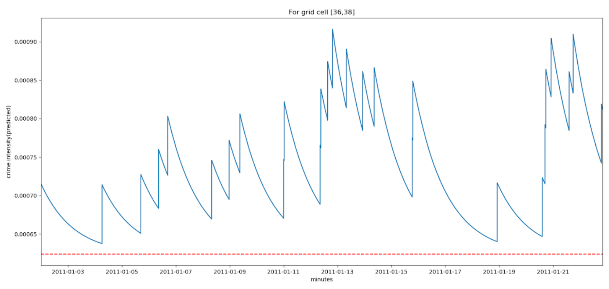

Bias in Predictive Policing: How biased data leads to biased results

# Bias in Predictive Policing: How biased data leads to biased results

## Do predictive policing algorithms decrease bias in policing efforts, as it is being claimed by PredPol? A critical analysis of the company's algorithm.

To answer this, we look at a certain model of predictive policing, which has been developed by a private enterprise called PredPol (Mohler et al., 2015). Notably, the company claims to establish objectivity in crime forecasting by only taking into account the crime type, crime location and crime date and time (PredPol, 2020). This company has been one of the few to release the mathematical foundation upon which its algorithm is based. As the foundation of its model, it assumes that crime events can be likened to the occurrence of aftershocks after an earthquake (Mohler et al., 2015). It states that regions which have previously experienced crime are likely to experience it again. By means of this mathematical model, the research leading question shall be examined. Two hypothesis will lead the investigation of the following work:
> H1: The usage of police gathered data leads to a perpetuation of bias, due to the method of how machine learning algorithms are being trained.
> 
> H2: The design of PredPol’s algorithm will inherently lead to an amplification of bias in police officers.

***
## PredPol’s predictive policing software
### Underlying assumptions by Predpol

There have been a number of algorithmic methods used to predict crime hotspot risks upon which PredPol has been building their work. These methods mostly concentrated on demographics (Wang & Brown, 2012), income levels (Liu & Brown, 2003), and distance to crime attractors (Kennedy, Caplan, & Piza, 2011). PredPol takes a new approach and uses an Epidemic-type aftershock sequence model (ETAS), “that estimates the risk associated with both long-term hotspots and short-term models of near-repeat risk” (Mohler et al., 2015, p. 4). The objective of PredPol’s approach is to predict crime rate for the following day by modelling previous crime data to an ETAS model. With these predicted crime rates, city police departments can distribute fixed patrolling resources to the riskiest (highest predicted crime rates) blocks in the city. PredPol’s claim is that by identifying these hotspots they can improve the rate of crime deterrence under the constraints of a fixed patrolling resource (PredPol, 2020). We discuss the working of the model below. In their 2015 work, Mohler et. al set up an experiment to compare PredPol’s effectiveness head-to-head with existing best practices of crime analysts in the Los Angeles and Kent police departments under day-to-day conditions (Mohler et al., 2015). The Los Angeles department relies on short-term, seven-day crime hotspot maps, while the Kent department uses an intelligence-led approach. They are able to show that the ETAS crime forecasting outperforms both the intelligence-led and hotspot mapping models. They conclude that “at mean patrol levels (31 minutes per box per day), the ETAS algorithm corresponds to 4.3 fewer crimes per week per division [...] a crime reduction of 7.4%” (Mohler et al., 2015, p. 29). However, these claims are not without their critics. Some scholars point out that the crime rate dropped in the area of Los Angeles during the time at which the experiment was conducted. The effect measured by Mohler et al. could therefore be linked to this general drop in crime at this specific period of time, rather than the successful implementation of the PredPol method (Meijer & Wessels, 2017).
Yet, the purpose of this paper is not to debate the effectiveness of the model on crime deterrence. It must be noted, however, that such predictive policing solutions are not longterm crime reduction solutions. In fact, over-reliance on such models removes the agency of ‘personal affect’ a police officer may have to an area they patrol regularly (Bennet Moses & Chan, 2016). Decisions of policing that target repeat offenders they deny the possibility that a neighbourhood or area of the city might actually improve in terms of crime.

### PredPol’s model

The PredPol model is based entirely on the assumption that crime follows an earthquakeaftershock epidemic model. Take for instance household burglaries - studies show that for a house that has been burgled, there is an elevated risk of burglary in nearby space (neighbouring houses within 200m) and time (few coming weeks) (Mohler et al., 2011). This is much like the increased likelihood of occurrence of aftershocks close (in time and space) to a previous earthquake. Mohler et al. (2011) show that this model, fitted to residential burglary data from the LAPD from 2004, has a higher accuracy at predicting daily number of crimes than the wellestablished and widely used crime hotspotting methods (e.g. the COMPSTAT method that was made popular by the NYPD (Willis, Mastrofski & Weisburd, 2007)). The authors attribute for the difference in accuracy between the two methodologies of the crime hotspot map’s failure to account for the background rate of crime. While prospective crime hotspot maps used for crime prediction attempt to quantify the contagious spread of crime following past events, they fail to assess the likelihood of future “background” events, the initial events that trigger crime clusters. Prospective hotspot mapping using historical data takes into account all events for a period of time T backward in history from tk for estimating the crime rate λ at time t. It also takes into account events in the surrounding space of point (xk ,yk). The probability density function used to estimate the crime rate is chosen such that the elevated risk increases with earthquake magnitude and decreases in space and time away from each event.

Mohler et al.’s model takes the form below, modelling both the background rate and the contagion effect or the ‘aftershock’. Background events occur independently according to a stationary Poisson process μ(x, y). Each of these earthquakes then elevates the risk of aftershocks and the elevated risk spreads in space and time according to the kernel g(t, x, y). Like the previous model, the kernel g is centred around the points (xk
,yk,tk) (Mohler et al. 2015).

According to Mohler et al. (2015), the g or triggering kernel is an exponentially decaying probability density function. Thus the probabilistic rate λn(t) of events (in this case crimes) in box n at time t was determined by

> Figure 1. This graph shows the crime intensity estimation in a 1kmx1km grid cell in LA across 3 weeks as per Mohler’s ETAS model. The red line shows the constant background crime intensity and the spikes in intensity are triggered by new crime events. This is the grid cell that, according to our PredPol model of LA’s crime rates, would see the highest police patrolling.

This is hence a self-exciting point process model which can be understood intuitively by viewing it as a branching process. Initial events occur according to a Poisson process with constant rate µ. the background rate µ is a nonparametric histogram estimate of a stationary Poisson process - If over the past 365 days a grid cell has a high crime volume, the estimate of µ will be large in that grid cell. Events (from this initial process) each give birth to N direct offspring events, where N is a Poisson random variable with parameter θ. As events occur, the rate of crime increases locally in space, leading to a contagious sequence of “aftershock” crimes that eventually dies out exponentially, or gives birth to a subsequent set of events at a later time. tin
stands for the time of an event in box n, ω quantifies the time
decay of a shock, θ captures the degree to which aftershocks are generated from an initial event.
To fit the (xk ,yk,tk) point data (taken from LA and Kent police departments in the paper) to this
model, Mohler et al. use an expectation-maximisation algorithm. This algorithm is equivalent to a gradient-ascent algorithm on the likelihood of the branching process i.e. the probability that event j is a direct offspring of event i and the probability that the event j was generated by the Poisson process µ.

***

## Applying the PredPol model to the Los Angeles PD
We use Mohler’s methodology (Mohler, 2015) to train a self-exciting point process on crime data from Los Angeles PD from the years 2010-2011. We then use this model to predict the riskiest parts of the city for the following days. We use a python implementation of Mohler’s expectation-maximisation training algorithm from the package OpenCP developed by the Quantitative Criminology Group at the University of Leeds (Daws, 2017). Input data used to fit the model came from the Los Angeles Police Department data portal. We filter out specific types of crime - arrests for drug-related crimes - for our findings. We are only interested in the time and location of these crimes. We divide the city into square grids of size 1kmx1km and estimate the parameter µ for the background poisson process for arrests in each grid cell. The training step also estimates values for θ and ω, note that these parameters are not n-dependent. We use 200 iterations of the expectationmaximisation step for the training algorithm, this number was arrived at through trial-anderror of attempts of reaching a stable parameter values. We divide the city into square grids of size 1kmx1km and estimate the parameter µ for the background poisson process for arrests in each grid cell. The training step also estimates values for θ and ω, note that these parameters are not n-dependent. We use 200 iterations of the expectation-maximisation step for the training algorithm, this number was arrived at through trial-and-error of attempts of reaching a stable parameter values. Once the model is fit with the estimated parameters, we use the model to generate predictions for crime rates in all the grid cells in the city one day at a time. Predictions for each day take into account the crime occurrences of all days prior to it in a ‘sliding window’ manner. This was done for the entire year of 2011. For each grid cell in every daily prediction we select the top 20 riskiest cells (grid cells with the highest crime rates) to be the ones that will be patrolled, similar to Mohler’s methodology (Mohler, 2015). We then add up how many times each grid cell will be patrolled in a year and plot that in figure A.

## Findings

Our model converges with the following parameter values: Theta = 0.13 and omega = 0.006. This means a decay rate of nearly 28 hours. The background parameter mu for most grid cells is of the order 10^-6. This means the aftershock effects’ magnitude given by theta * omega is nearly two orders higher. Hence the aftershock effects dominate, as is also evident by the slow decay rate.

As part of our findings we also look at a study by Gruenewald (2013) on the geospatial analysis of drug problems. This of interest to us because of Gruenewald’s tactful methodology of using inpatient data (patient discharge data from hospitals) to achieve an estimate of drug usage. We were unable to recreate these findings for ourselves from the large variety of open hospital databases because of their lack of granularity. It is possible to retrieve geocoded data of patients coded with the exact reason for drug-related hospitalisation, however this data is either behind paywalls (Missouri Dept of Health and Senior Services, Washington State Dept. of Health) or inaccessible behind bureaucratic procedures that would take months for the data to arrive (Illinois Dept. of Public Health, California Dept. of Public Health). A comparative study that pits hospitalisation data as the ‘ground truth’ to patterns of bias in predictive policing is a possible future research question.

> Figure 2. Figure showing predictions for LAPD patrolling schedules for 2011 as per Mohler’s methodology in (Mohler, 2015). We show that deploying PredPol leads to highly disproportional targeting of few areas in the city, especially when compared to another database of drug usage which shows drug usage is much more uniformly spread spatially.

Our findings stand in grim contrast to Gruenewald’s study. We see that deploying PredPol would result in extreme concentration of police patrolling rather than a more uniform distribution as Fig. 2 from Grunewald suggests. PredPol sends patrol units repeatedly nearly every day of the year to two regions in the city. This shows that data-led approaches like PredPol are not a panacea, and indeed their claims of superseding bias through objective data-decision making can be turned on its head. The case of PredPol in LA shows that it is imperative to adjust.

## Bias in Algorithms : Runaway Feedback Loop
Feedback is a critical element in batch learning. Though at the same time, feedback can quickly make every model at best inappropriate and at worst incorrect (Ensign et al., 2018). In terms of predictive policing, the above presented issue of unrepresentative data leads to the problematic case that, once the decision has been made to patrol a certain neighbourhood and crime is discovered in that area, this finding is being fed back into the algorithm which will then update the model on the basis of theses findings. This has the potential for the sample bias to be compounded over time, which will lead to a runaway feedback loop (Ensign et al., 2018). As discussed in chapter 3, basing police efforts on discovered incidents caused PredPol’s algorithm to substantially diverge from the true crime rate due to the fact that not all crime is being reported and police officers also don't respond to all reported crimes. This problem presents itself even though PredPol vaunts that it only takes the date of a crime, the location of a crime and the type of crime into account and thereby lowers subjective bias in the outcome of its model. In an ideal situation, the distribution of police forces would correspond to the true crime rate in an area, with the true crime rate being assumed to be the sum of discovered and reported incidents. That is, when 60% of crime were to happen in a certain neighbourhood, 60% of police forces would be deployed in this neighbourhood. When applying the PredPol model, it becomes clear that this is not the case. To illustrate the issue, Ensign et al. (2018) modelled the predictive policing process on a series of Pólya Urn models, containing balls of two colours, red and black. At each time step, one ball is drawn from the urn, the color is noted, and the ball is replaced. The replacement is being decided on the basis of the following replacement matrix:

It is being referred to the standard Pólya urn as a generalised urn with a = d = 1 and b = c = 0. This means that if a red ball is drawn, it will get replaced with a red balls and b black balls to the urn. This will eventually lead to the fact that statistics are getting skewed more and more towards (in this case) the red balls. Applied to the case of predictive policing, a police district that relies exclusively on the PredPol model will keep sending officers in the same district and e.g. racial biases of police officers by means of which the prediction model is being trained is getting reinforced. By reproducing the finding of Ensign et al. (2018) using crime data from the city of Oakland, the problematic functioning of PredPol’s model can be illustrated. Figure 1 shows the distribution of police officers over 1000 days. The number of incidents (xxx) is being used as the starting number of balls in the urn for the region. The urns are then updated based on the estimated number of daily drug use incidents, i.e., λA
= 3.68511 λB = 2.816466.
So even assuming that if an officer goes to a location A with an underlying true crime rate of λA
, the officer discovers crime at a rate of λA . I.e., dA = λA . The consequence of this is that
when using the PredPol model even under ideal circumstances, the distribution of police forces will be converged to only sending police to the neighbourhood with the most crime and disregarding all other areas.

> Figure 3. distribution of police force over 1000 days, when training the model only by means discovered incidents of crime. While the true crime rate would require 56.7% of the police force to patrol a certain area (green line), the runaway effect described in the urn model is strongly visible.

The urn model intuitively shows that using PredPol to schedule patrols will lead to a situation where only the neighbourhood(s) with higher historical arrests will get patrolled. This is concerning because ideally such a predictive policing algorithm should converge to scheduling patrols that are in proportion to the true crime rates of neighbourhoods. This proves that apart from biased training data, the design of the algorithm itself perpetuates bias of higher police presence in certain communities. As mentioned above, it is being argued how police contact with only members of certain communities biases training data that predictive policing algorithms may use - such a runaway effect will show up in the training data as well by increasing police contact with certain neighbourhoods in a disproportionate manner. There is, however, a caveat to these findings. We observe absolute runaway effects (police targeting only the riskiest neighbourhood(s)) under the condition that training data consists only of incidents discovered by the police. A manifestation of this assumption would be to train PredPol only on police arrest data. However, as per their website, PredPol uses all reports of crime incidents (PredPol, 2020). The model used in this paper that predicted crime rates in Chicago was also trained using all reported crime incidents. Figure 2 shows that increasing the weightage given to incident reports in training data attenuates the runaway effects. However even in an ideal situation where discovered and reported data have an equal weightage, the algorithm does not converge to the true crime rates and ends up scheduling patrols more disproportionately more frequently in the riskier neighbourhood.

> Figure 4. Distribution of police force over 1000 day, when training the model with a weighted distribution of discovered crime and reported crime. While the true crime again lies at 56.7%, the distribution of police force can be observed to converge towards only the neighbourhood with the highest number of historical crimes, as the weighing of observed crime and reported crime shifts from 0.5 over 0.7 to 0.9 in favour of discovered crime.

***

## Conclusion
The purpose of this project was to investigate whether predictive policing algorithms would decrease bias in policing efforts, as it is being claimed by the company PredPol. To do so we performed a critical analysis of the company's algorithm to see whether the company’s claims of establishing objectivity in crime forecasting by only taking into account the crime type, crime location and crime date and time is true. To do that, it was being assumed that the usage of police gathered data would lead to a perpetuation of bias, due to the method of how machine learning algorithms are being trained. Also, it was being presumed that the design of PredPol’s algorithm would inherently lead to an amplification of bias in police officers. Over the course of analysis, both of these assumptions turned out to be true. PredPol’s attempt to decrease bias in their training data by focusing only on three parameters that seemingly do not ascribe any character traits that could lead to a biased assessment of the subject turned out to be a false assumption. We were able to show that human bias underlies all actions and thereby influences the decisions of police officers in the sense of in what neighbourhoods to patrol, who should be arrested and how to handle minorities in comparison to majorities. These decisions are being formalised in the way of arrest reports which then in turn are being fed to machine learning algorithms with the goal of predicting future crime. In light of these findings, it leads us to conclude that predictive policing algorithms are not decreasing bias in policing efforts. However, there are limitations to the scope of the paper. One lies with the lack of data on the true crime rate of a given area. Many researchers equate the true crime rate with the amount of arrests and reported crimes in a given area. While this work tried to circumvent this fact by looking into hospital discharge data, more social science research is needed in this field. Even though open access to crime data is getting increasingly better, many (American) cities are as of yet still very much very reluctant to share a complete set of data on crime. Another
limitation to exhaustive research in the field of predictive policing is the lack of transparency in the models created by predictive policing companies. This caveat is hoped to become better in the future. While being able to support police forces in the distribution of resources in time and space, police forces should not solely rely on predictive policing models to decide where to go and who to arrest. A critical reflection on the underlying biases of policing decisions is necessary to ascertain the true crime rate, instead of relying on historical crime data. Determining the true crime rate is a critical topic for further criminology research, since this paper, along with others, was able to show the biases in historical police data (Langan, 1995; Levitt, 1998; Morrison, 1897; Mosher, 2010). This is because only by using data on the true crime rate, predictive policing models can be trained to accurately predict crime in the future, without discriminating individuals or targeting disadvantaged groups. So that eventually predictive policing models will accurately predict where crime is going to happen and not where police will be.
